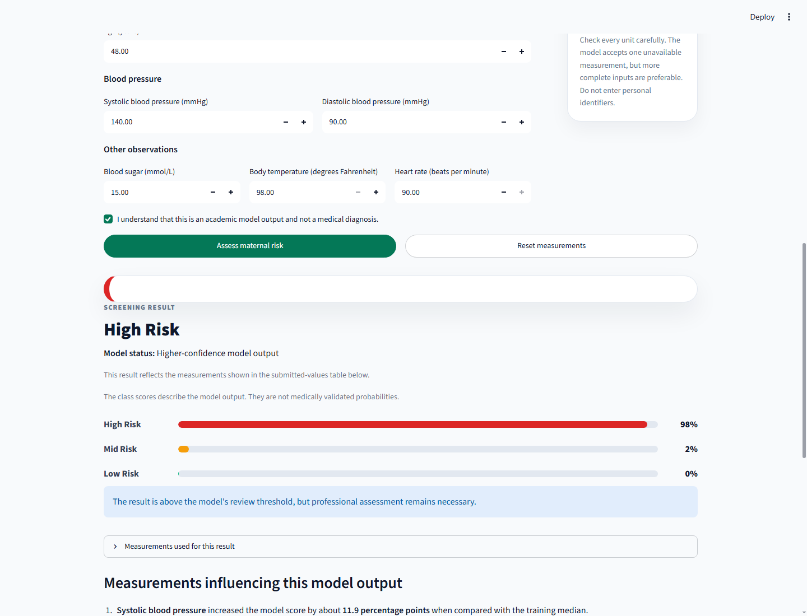
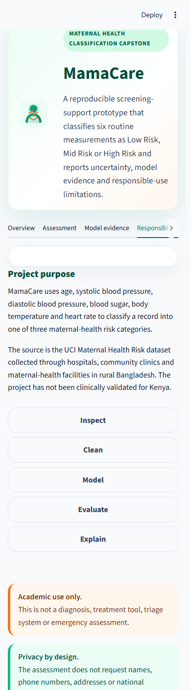

# MamaCare: Maternal Health Risk Classification Capstone



<p align="center">
  
</p>

## Overview
MamaCare is a reproducible classification capstone that predicts **Low Risk**, **Mid Risk**, or **High Risk** from six routine maternal-health measurements. The repository contains a trained model pipeline, a polished Streamlit demonstration interface, an executed end-to-end notebook, evaluation reports, automated tests, a model card, a Responsible AI statement, and a five-slide presentation. The public project is hosted at [github.com/mikaye2005/Maternal_Health_Risk_Prediction](https://github.com/mikaye2005/Maternal_Health_Risk_Prediction).

## Problem Statement
MamaCare classifies maternal-health records represented in the UCI Maternal Health Risk dataset into Low Risk, Mid Risk or High Risk using age, systolic blood pressure, diastolic blood pressure, blood sugar, body temperature and heart rate. The primary evaluation metric is **Weighted F1** on an untouched measurement-signature-separated test set. Macro F1, High Risk recall, accuracy and log loss are reported as secondary metrics, and High Risk recall is disaggregated by age group.

## Dataset
| Property | Details |
|---|---|
| Name | Maternal Health Risk Dataset |
| Source | [UCI Machine Learning Repository](https://archive.ics.uci.edu/dataset/863/maternal%2Bhealth%2Brisk) |
| DOI | 10.24432/C5DP5D |
| Licence | CC BY 4.0 |
| Downloaded CSV | 1,014 rows x 7 columns |
| Metadata discrepancy | UCI reports 1,013 instances; the downloaded CSV used here contains 1,014 rows |
| Target | `RiskLevel`: low risk, mid risk, high risk |
| Inputs | Age, SystolicBP, DiastolicBP, BS, BodyTemp, HeartRate |
| Population represented | Records documented by UCI as collected through hospitals, community clinics and maternal-health facilities in rural Bangladesh |
| Dataset hash | `a1f7025719f84715096e0d1f95ae2e56b57809b9b15449e1836c96a7d976ae9b` |

## Methods
- **Data-quality audit:** missing values, exact duplicates, implausible values and contradictory labels.
- **Leakage prevention:** `StratifiedGroupKFold` keeps identical six-measurement signatures in only one partition.
- **Feature engineering:** PulsePressure, MeanArterialPressure and AgeBand inside the serialized pipeline.
- **Models compared:** majority baseline, Logistic Regression, Decision Tree, Random Forest, SVC, Gradient Boosting, XGBoost, shallow MLP, deep MLP and Soft Voting.
- **Primary metric:** validation Weighted F1, followed by Macro F1 and High Risk recall as secondary checks.
- **Fairness criterion:** Equal Opportunity for High Risk identification across age groups.
- **Scope decisions:** the neural networks are scikit-learn MLP comparisons rather than the proposal's Keras/dropout/batch-normalisation architectures; clinical threshold flags were excluded because no validated rule set was available. See [docs/SCOPE_DECISIONS.md](docs/SCOPE_DECISIONS.md).

## Results
| Metric | Majority Baseline | ShallowMLP |
|---|---:|---:|
| Accuracy | 0.399 | 0.596 |
| Weighted F1 | 0.228 | 0.558 |
| Macro F1 | 0.190 | 0.571 |
| High Risk recall | 0.000 | 0.818 |
| Log loss | Not applicable | 0.773 |

### Class-level performance
| Class | Precision | Recall | F1 | Support |
|---|---:|---:|---:|---:|
| High Risk | 0.918 | 0.818 | 0.865 | 55 |
| Low Risk | 0.524 | 0.815 | 0.638 | 81 |
| Mid Risk | 0.357 | 0.149 | 0.211 | 67 |

### Disaggregated performance by age group
| Age group | N | High Risk N | Weighted F1 | Macro F1 | High Risk recall |
|---|---:|---:|---:|---:|---:|
| <=19 | 77 | 8 | 0.350 | 0.372 | 0.375 |
| 20-34 | 58 | 10 | 0.556 | 0.596 | 0.700 |
| 35-49 | 40 | 22 | 0.842 | 0.596 | 0.955 |
| >=50 | 28 | 15 | 0.751 | 0.564 | 0.933 |


## Important findings
- The selected model is **ShallowMLP**.
- It improves Weighted F1 from **0.228** to **0.558**.
- High Risk recall is **0.818**, but Mid Risk recall remains only **0.149**.
- The dataset contains **562 exact duplicate rows**.
- **35 identical measurement signatures have conflicting labels**, covering **215 rows**.
- High Risk recall varies substantially by age group; the Equal Opportunity gap is **0.580**.

## Limitations
- This is a small public dataset with extensive duplication and contradictory labels.
- The six inputs omit pregnancy stage, medical history, symptoms, laboratory context and facility information.
- The model is not clinically validated for Kenya or any real patient population.
- Dataset input bounds are not clinical normal ranges.
- The interface must not be used for diagnosis, treatment, triage, emergency decisions or automatic referrals.

## Responsible Use
The fairness criterion is **Equal Opportunity for High Risk identification across age groups**. The complete statement is available in [reports/responsible_ai_statement.pdf](reports/responsible_ai_statement.pdf).

## Repository Structure
```text
MamaCare_Capstone_Submission/
|-- app/                  # Streamlit frontend and tested helper functions
|-- assets/               # brand files and live frontend screenshots
|-- data/                 # raw and processed datasets
|-- docs/                 # data dictionary, model card and guides
|-- models/               # fitted pipeline and training metadata
|-- notebooks/            # executed end-to-end notebook
|-- presentation/         # five-slide deck and speaker notes
|-- reports/              # report, Responsible AI PDF, figures and tables
|-- scripts/              # notebook, cleanup and verification utilities
|-- src/                  # reusable data science pipeline code
|-- tests/                # backend, frontend-state and submission tests
|-- README.md
`-- requirements.txt
```

## How to Run
### Windows PowerShell
```powershell
py -3.14 -m venv .venv
.\.venv\Scripts\python.exe -m pip install --upgrade pip
.\.venv\Scripts\python.exe -m pip install -r requirements.txt
.\.venv\Scripts\python.exe -m src.train
.\.venv\Scripts\python.exe scripts\build_notebook.py
.\.venv\Scripts\python.exe -m nbconvert --execute --to notebook --inplace notebooks\MamaCare_End_to_End.ipynb
.\.venv\Scripts\python.exe -m pytest -q -p no:cacheprovider
.\.venv\Scripts\python.exe -m streamlit run app\app.py
```

### macOS or Linux
```bash
python3.14 -m venv .venv
source .venv/bin/activate
python -m pip install --upgrade pip
python -m pip install -r requirements.txt
python -m src.train
python scripts/build_notebook.py
python -m nbconvert --execute --to notebook --inplace notebooks/MamaCare_End_to_End.ipynb
python -m pytest -q -p no:cacheprovider
python -m streamlit run app/app.py
```

## Submission Documents
- `reports/MamaCare_Capstone_Report.pdf`
- `reports/responsible_ai_statement.pdf`
- `presentation/MamaCare_Capstone_Presentation.pdf`
- `presentation/speaker_notes.md`
- `docs/CAPSTONE_COMPLIANCE_CHECKLIST.md`

## Author
**Collins Mikaye**  
Computer Science Capstone Project  
[GitHub profile](https://github.com/mikaye2005) | [MamaCare repository](https://github.com/mikaye2005/Maternal_Health_Risk_Prediction)
